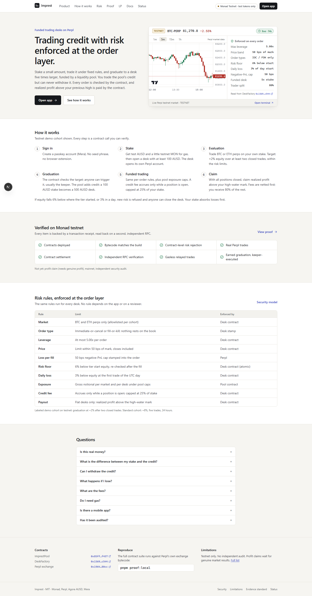

# Imprest

**Trade with more than your own stake, under rules a contract enforces.**

Imprest is a funded-trading desk for perpetual futures on Perpl (Monad). You put up a small
stake, trade it under fixed risk rules, and if you hit the profit target you graduate to a desk
several times larger. The extra capital is credit from a liquidity pool: you can trade it
through your desk but never withdraw it. Every order is checked by the desk contract before it
reaches Perpl, and realized profit above your previous high is paid out by the contract.

> **Status: Monad testnet only. Test tokens, no real money.** Built for Monad Metropolis,
> Track 1 (Onchain Finance & Trading). No independent security audit. Mainnet is not deployed.
>
> Live app: **https://imprest-chi.vercel.app** · Proof: [/proof](https://imprest-chi.vercel.app/proof) ·
> Live checks: [/status](https://imprest-chi.vercel.app/status)



## Who it is for and why

Traders who can trade but lack capital usually go through prop-firm evaluations, where the
rules are written in a policy document and payouts depend on the firm. Imprest puts the rules
and the payout in contracts instead:

- **Qualifying is mechanical.** The profit target, number of closed trades and time in tier are
  checked by the desk contract. No reviewer decides.
- **The limits are enforced inside every order.** Leverage, price band, risk floor and daily
  loss are checked in the same transaction as the trade. An order that breaks a rule reverts.
- **Payout is by contract.** Realized profit above the high-water mark is split by fixed
  shares (80% trader on the funded tier) and paid in the same transaction as the claim.
- **Credit cannot leave.** Pool credit sits in the desk's own Perpl account. Apart from margin
  in that account, the desk can only send AUSD to the pool (principal, fees, profit share), the
  trader (claimed profit or final residual), the protocol treasury, or a keeper (a capped bounty, once).

## How it works

1. **Sign in** with a passkey (Mera). No seed phrase or browser extension.
2. **Get test tokens.** Testnet MON for gas (Monad faucet) and testnet AUSD (button on the dashboard).
3. **Open a desk** with a stake of at least 100 AUSD. The desk opens its own Perpl account.
4. **Evaluation.** Trade BTC/ETH perps on your stake. Demo cohort target: **+2% equity over at
   least 2 closed trades** (standard cohort: +8%, 5 trades, 24 h).
5. **Graduation.** Anyone (usually the keeper) calls `graduate()`; the contract re-checks the
   rules and the pool adds credit: a 100 AUSD stake becomes a 500 AUSD desk.
6. **Funded trading** under the same per-order rules plus pool exposure caps. A credit fee
   accrues only while a position is open, capped at 25% of stake.
7. **Claim.** With all positions closed, claim realized profit above the high-water mark.
   Fees are netted first; the trader gets 80% of the remainder.

If equity falls below the floor (6% under the tier start) or the daily limit (3%), new risk is
refused and anyone can call `enforce()` to close the desk. Your stake absorbs losses first.

## What you can do on the hosted app today

| Works now | Notes |
| --- | --- |
| Browse the live BTC/ETH market, risk rules, proof and status | No wallet needed |
| Create a passkey account, get test AUSD, open a desk, trade, close, claim | Needs testnet MON for gas: the hosted site has no public relayer, so you submit transactions yourself |
| Watch risk, positions, history and receipts | Without the indexer (it runs only on the developer's machine), History reads the chain directly and covers only the most recent ~5,000 blocks (about half an hour) |

Not available on the hosted site: gasless trading (relayed intents were verified from a script;
no relayer is publicly reachable from the browser), the Envio indexer, and passkey sign-in inside
the native mobile app (it needs a linked domain).

## For judges: inspect without a wallet

- [/proof](https://imprest-chi.vercel.app/proof): each claim with its receipt, transaction and explorer link.
- [/status](https://imprest-chi.vercel.app/status): live RPC, Perpl and contract checks, plus protocol status from receipts.
- [docs/CLAIM_LEDGER.md](docs/CLAIM_LEDGER.md): every claim and its evidence label.
- [proof/receipts/testnet/](proof/receipts/testnet/): raw receipts, each read back on a second RPC.
- [/api/version](https://imprest-chi.vercel.app/api/version): the commit the live site was built from.
- Demo video: not recorded yet.
- Reproduce locally: `pnpm proof:local` (contract suite on Perpl's own bytecode plus a reference model).

## What is proven, and how strongly

| Result | Label |
| --- | --- |
| ImprestPool and DeskFactory deployed; runtime bytecode matches the build on two RPCs | **TESTNET_VERIFIED** |
| A 6x order sent straight to the desk reverted `LeverageExceeded`; a premature `graduate()` reverted `GraduationNotEligible` | **TESTNET_VERIFIED** |
| Real Perpl trades opened and closed; a flat desk closed with 99.95 AUSD paid by contract | **TESTNET_VERIFIED** |
| Trader-signed intents submitted by the relayer filled on Perpl (submitted from a script, not via the hosted site) | **TESTNET_VERIFIED** |
| Desk `0xfc65…FCC6` earned +2% over two closed trades; the keeper called `graduate()`; the pool funded 400 AUSD | **TESTNET_VERIFIED** |
| After graduation, two real attempts to reach profit above the high-water mark lost money; the stake absorbed it and pool credit stayed intact | **TESTNET_VERIFIED** (receipts 06–13) |
| 120 contract tests (unit, fuzz, invariant, security, paired-desk) against **Perpl's own exchange bytecode**; reference model 26/26 | LOCAL_REPRODUCTION |
| Pre-registered replay: in-transaction enforcement vs a 1 s keeper, median gap **0.0 bps** (n = 51): **null result, headline dropped** | SIMULATED |
| Qualifying profit claim, mainnet, real outside traders, independent audit | **PENDING** |

Full list: [docs/CLAIM_LEDGER.md](docs/CLAIM_LEDGER.md). Current state: [docs/BUILD_STATE.md](docs/BUILD_STATE.md).

## Why Monad and Perpl

Every order runs the full rule set and a post-fill equity re-check inside one transaction.
That needs an onchain order book with a programmable account interface (Perpl's `execOrder`,
negative-PnL stamp and IOC/FOK order types), and gas cheap enough for a multi-call trade.
Measured on Monad testnet: a guarded relayed trade costs about 0.07 MON at 102 gwei. On another
EVM chain the contracts would compile, but without Perpl the venue layer would have to be rewritten.

## The rules, in detail

| Rule (every order) | Enforced by |
| --- | --- |
| Allowlisted market (BTC, ETH) | Desk |
| IOC or FOK only (no resting orders exist) | Desk stamp |
| Leverage at most 5x | Desk (Perpl clamps rather than rejects, so this is load-bearing) |
| Limit price within 50 bps of mark, closes included | Desk |
| 50 bps negative-PnL cap, 2-block execution window | Desk stamp, enforced by Perpl |
| Valid mark for new risk; reduce-only always allowed | Desk |
| Equity above the 6% floor and 3% daily floor before and after the fill | Desk (whole transaction reverts) |
| Gross funded exposure per market and per desk under caps | Pool, same transaction |
| Credit fee only while exposed, capped at 25% of stake | Desk |
| Claims flat-only, realized profit above the HWM, fees netted first | Desk |
| Breach / fee-cap settlement: principal, keeper (once), fees, trader | Desk + Pool |

Known risks: a price gap larger than the stake can cost the pool principal (see the
paired-desk results on /proof); Perpl and Agora admins can freeze or force-close; the code has
had an internal automated review only ([docs/SECURITY_REVIEW.md](docs/SECURITY_REVIEW.md)).

## Repository

```
contracts/   Foundry: Desk, DeskFactory, ImprestPool, SettlementMath; tests on Perpl bytecode
packages/core  shared TS: config, ABIs, errors, EIP-712, policy pre-check, accounting, verification
web/         Next.js: landing, trading app, risk center, claims, LP console, /proof, /docs, /status
app/         Expo (React Native) mobile client on the same shared core: Home, Trade, Positions, Risk, Claims, History
relayer/     EIP-712 intent relayer (fetch handler + Node adapter)
keeper/      enforce / graduate / checkpoint watcher (simulate-then-send)
indexer/     Envio HyperIndex v3 config, schema, handlers
scripts/     Gate 0, claims, evidence validator, deployment sync, testnet canonical run
proof/       receipts, experiments, reference model, generated claims
config/      networks.json: the only place addresses live
docs/        architecture, security, threat model, runbooks, status
```

## Quick start

```bash
pnpm install
cd contracts && forge build && cd ..
pnpm proof:local                                   # contract suite on Perpl bytecode + reference model
NEXT_PUBLIC_IMPREST_ENV=testnet pnpm --filter @imprest/web dev    # http://localhost:3000
```

### See the mobile app on your phone

1. Install **Expo Go** from the App Store or Google Play.
2. Put the phone on the same Wi-Fi as this computer.
3. Run `npm run mobile` (first time: `cd app && npm install`).
4. Scan the QR code that appears in the terminal (Android: inside Expo Go; iPhone: Camera app).

Expo Go shows every screen and live testnet BTC/ETH prices. Passkey sign-in, and so your desk and trading
from the phone, do not work in Expo Go: it needs a domain linked to the app and a
development build. What that takes and costs is in [docs/MOBILE.md](docs/MOBILE.md).

Security: an internal automated review is in [docs/SECURITY_REVIEW.md](docs/SECURITY_REVIEW.md).
No independent third-party audit has been performed.

Requirements, every test command and the experiments: [docs/SETUP.md](docs/SETUP.md).
Testnet deployment (needs a deployer key funded with testnet MON):
[docs/TESTNET_DEPLOYMENT.md](docs/TESTNET_DEPLOYMENT.md). Demo path:
[docs/DEMO_RUNBOOK.md](docs/DEMO_RUNBOOK.md).

## Docs

[Architecture](docs/ARCHITECTURE.md) · [Security](docs/SECURITY.md) · [Security review](docs/SECURITY_REVIEW.md) · [Mobile](docs/MOBILE.md) · [Testnet](docs/TESTNET.md) ·
[Threat model](docs/THREAT_MODEL.md) · [Decisions](docs/DECISIONS.md) ·
[Known limitations](docs/KNOWN_LIMITATIONS.md) · [Evidence standard](docs/EVIDENCE_STANDARD.md) ·
[Test matrix](docs/TEST_MATRIX.md) · [Networks](docs/NETWORKS.md) · [API](docs/API.md) ·
[Operations](docs/OPERATIONS.md) · [Failure modes](docs/FAILURE_MODES.md) ·
[Sponsor findings](docs/SPONSOR_FINDINGS.md) · [Dependency matrix](docs/DEPENDENCY_MATRIX.md)

## Mainnet limitations

Mainnet needs real AUSD seed credit (about 300 AUSD per the PRD) and owner authorization;
neither has happened. Perpl's testnet margins in Agora testnet AUSD, so the full AUSD flow is
provable on testnet. The register of what needs mainnet, why, and what it costs is in
[docs/KNOWN_LIMITATIONS.md](docs/KNOWN_LIMITATIONS.md).

## Evidence policy

Zero fabrication. Every public number is generated from a file in `proof/` and carries its
strongest honest label: PENDING, TARGET, SIMULATED, LOCAL_REPRODUCTION, TESTNET_VERIFIED or
MAINNET_VERIFIED. `pnpm validate-evidence` fails CI on any violation. User actions in the app
show "verified" only after an independent RPC reads back the expected state.

## AI disclosure

AI tools (Anthropic's Claude) drafted, under review, the contracts, tests, services, web app,
scripts, experiments and documentation in this repository. The human author specified the
product, the policy rules, the invariants and the economic parameters in the PRD, and is
responsible for reviewing them line by line before any capital is involved. All measured
results were produced by running the code in this repository; none were written by hand.

## License

MIT
